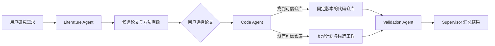

# Module Agent

Module Agent 是一个面向计算机科研场景的多 Agent 系统。

用户提交研究方向、时间范围和论文质量要求后，系统会自动检索并筛选论文，提取论文
解决的问题和核心方法；用户确认感兴趣的论文后，系统继续寻找可信代码仓库。若论文
没有公开实现，则生成明确标记的复现计划和候选工程，最后由独立的 Validation Agent
检查产物质量。

这个项目希望把原本分散的“找论文 → 找代码 → 判断是否可信 → 验证能否使用”过程，
组织成一条可以暂停、恢复和追踪的工作流。

## 工作流程



工作流由 LangGraph 驱动。论文检索和代码处理通过 RabbitMQ 放到独立 worker 中运行，
执行状态保存在 PostgreSQL。即使 API 或 worker 重启，任务也可以从 checkpoint 继续。

## 四个 Agent 分别做什么

| Agent | 主要职责 |
|---|---|
| Literature Agent | 规划检索词，聚合论文来源，去重、筛选、排序并提取方法画像 |
| Code Agent | 从 GitHub、论文 PDF 和论文页面发现仓库，判断可信度并获取代码 |
| Validation Agent | 对仓库或复现产物进行静态检查，以及显式授权的隔离验证 |
| Supervisor Agent | 校验工作流状态，决定下一步、等待、重试或结束 |

Agent 之间不直接传递数据库对象或 HTTP 对象，而是通过 Pydantic 领域模型和
LangGraph 状态交换数据。这样每个 Agent 都可以独立测试和替换实现。

## 当前能力

### 文献检索

- 接入 OpenAlex 和 Semantic Scholar；
- 支持主题、关键词、排除词、时间范围和指定会议期刊；
- 支持 CCF、ICORE 等会议期刊等级筛选；
- 使用 DOI 和规范化标题进行跨来源去重；
- 可使用 Qwen 扩展英文检索词、评估相关性并提取方法画像；
- 单个来源失败时自动降级，保留其他来源的结果。

### 代码发现与复现

- 通过 GitHub 搜索、论文 PDF、论文页面和补充材料发现代码仓库；
- 根据论文直链、DOI、标题、作者和关键词生成可解释的可信度评分；
- 区分官方仓库、作者仓库、第三方实现以及证据不足的候选；
- 安全浅克隆仓库并固定 commit SHA；
- 分析依赖文件、入口、数据集、模型权重和可能的算法模块；
- 没有可信仓库时生成复现计划和明确标记的候选工程。

### 验证与工作流

- 默认只进行静态检查，不自动执行第三方代码；
- 可显式启用受 CPU、内存、网络和超时限制的 Docker 沙箱；
- 在论文选择和异步任务处暂停，并从原 LangGraph checkpoint 恢复；
- 保存 LiteratureRun、CodeRun、ValidationRun 和总工作流生命周期；
- 支持超时、取消、有限重试和死信恢复；
- 提供 Prometheus 指标、Grafana 面板和 Alertmanager 告警。

## 技术架构

项目采用模块化单体：代码在同一仓库中，但每项业务能力都有独立的领域模型、应用层
和基础设施适配器。

```text
src/module_agent/
├── literature/       论文检索、筛选、方法画像
├── code/             仓库发现、可信度评分、复现产物
├── validation/       静态检查和受控沙箱验证
├── supervision/      Supervisor 决策与观察记录
├── workflow/         LangGraph 总流程、暂停和恢复
├── venue_catalog/    会议期刊及 CCF/ICORE 评级
├── bootstrap/        依赖注入和对象组装
├── shared/           数据库、消息、缓存和外部客户端
├── api/              FastAPI 中间件、健康检查和异常处理
└── cli/              Worker 与运维命令入口
```

主要技术：

- FastAPI、Pydantic v2、SQLAlchemy 2、Alembic
- LangGraph、Qwen、可选 Jev 策略
- PostgreSQL、RabbitMQ、Redis
- GitHub REST API、OpenAlex、Semantic Scholar
- Docker、Prometheus、Grafana、Alertmanager
- uv、pytest、Ruff、basedpyright、GitHub Actions

## 快速启动

需要安装 Docker、Docker Compose 和
[uv](https://docs.astral.sh/uv/)。

```bash
git clone https://github.com/starrysky123321/module-agent.git
cd module-agent

cp .env.example .env
uv sync
docker compose up -d --build
```

检查服务：

```bash
docker compose ps
curl http://127.0.0.1:8000/api/health/ready
```

常用入口：

- OpenAPI：<http://127.0.0.1:8000/docs>
- RabbitMQ：<http://127.0.0.1:15672>
- Prometheus：<http://127.0.0.1:9090>
- Grafana：<http://127.0.0.1:3000>

OpenAlex、Semantic Scholar、GitHub、Qwen 和 Jev 等外部能力通过 `.env` 配置。
没有配置某项可选能力时，系统会使用规则实现或关闭相应功能。

## 跑一次完整流程

项目提供了完整 API 验收命令。它会创建文献任务、等待检索、选择排名靠前的论文、
运行 Code Agent 和静态 Validation，最后输出每个阶段的耗时和最终结果。

```bash
uv run python -m module_agent.cli.run_release_acceptance \
  --topic "graph attention networks for node classification" \
  --keyword "graph attention network" \
  --max-results 3 \
  --paper-count 1
```

这条验收命令不会安装论文依赖，也不会运行论文实验。需要手动控制论文选择或验证策略
时，可以直接使用 OpenAPI 页面调用 `/api/literature`、`/api/workflow`、
`/api/code` 和 `/api/validation` 接口。

## 质量与安全边界

- 生产环境支持 Bearer Token、Redis 限流、审计日志和文件式 Secret；
- 应用容器使用非 root 用户和只读根文件系统；
- PDF 下载限制地址、重定向、大小、页数、解析时间和内存；
- Code Workspace 与沙箱路径都进行越界检查；
- RabbitMQ 使用持久化 Quorum Queue，完成事件支持有界重放；
- PostgreSQL 重启后 completion worker 可以重建 LangGraph 连接池；
- 当前自动化回归为 1100+ tests，覆盖率保持在 85% 以上。

运行本地检查：

```bash
uv run pytest -q --cov=module_agent --cov-fail-under=80
uv run ruff check src tests
uv run basedpyright src --level error
uv run alembic check
docker compose config --quiet
```

## 当前边界

当前版本定位为单用户 MVP，暂未实现多租户身份、任务归属和行级数据隔离。系统生成的
复现代码属于需要继续验证的候选产物，不会冒充论文官方实现。官方仓库识别、检索质量
和复现完整度还需要通过更多真实研究任务持续评估。

如果把项目继续向产品方向推进，下一阶段会重点建立真实论文评测集，量化文献
Precision/Recall、官方仓库识别准确率、验证拦截率、端到端时延和模型成本。
